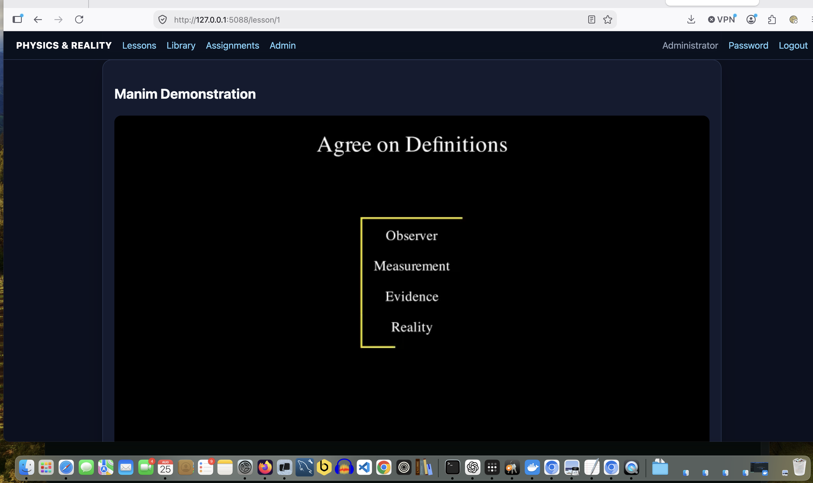
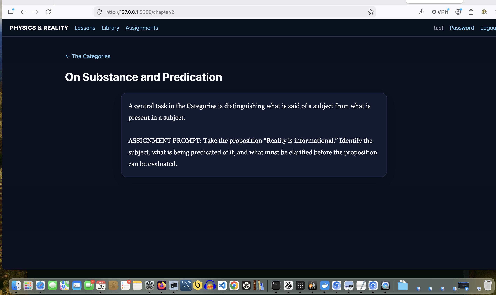
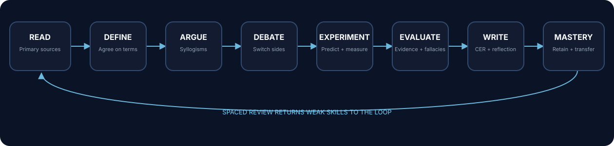

# Physics & Reality Tutor

[](https://github.com/iamrichmack111/physics-reality-tutor/actions/workflows/ci.yml)
[](https://github.com/iamrichmack111/physics-reality-tutor/actions/workflows/codeql.yml)
[](https://github.com/iamrichmack111/physics-reality-tutor/actions/workflows/container.yml)
[](https://github.com/iamrichmack111/physics-reality-tutor/pkgs/container/physics-reality-tutor)
[](https://www.python.org/)
[](https://flask.palletsprojects.com/)
[](https://physics.richmackos.com)

**Physics & Reality Tutor** is a self-paced Physics, Philosophy, Logic, Math, and ELA learning platform built around Aristotelian argument, primary-source reading, interactive experiments, debate, adaptive mastery, spaced review, and self-grading.

**Live:** https://physics.richmackos.com

## Screenshots

### Interactive Experiment Lab

Students predict, manipulate variables, observe results, graph relationships, and record conclusions instead of only reading about physics.


### Manim-guided concept lessons

Lessons combine definitions, propositions, simplified syllogisms, counterarguments, and visual explanations.



### Primary-source reader

The built-in reader supports public-domain Aristotle, Berkeley, and Hume texts, reading progress, assignments, and comprehension work.



## Course architecture — D2

The course itself is modeled as a reasoning loop rather than a sequence of passive pages.



D2 source is versioned in the repository:

- [`static/course_map.d2`](static/course_map.d2) — homepage learning map
- [`docs/diagrams/learning-loop.d2`](docs/diagrams/learning-loop.d2) — curriculum/reasoning architecture
- [`docs/diagrams/deployment.d2`](docs/diagrams/deployment.d2) — RichmackOS production architecture

CI parses and renders the D2 sources on every push to catch broken diagrams.

## Learning model

```text
READ → DEFINE → ARGUE → DEBATE → EXPERIMENT → EVALUATE → WRITE → MASTERY
          ↑                                                     ↓
          └────────────────── SPACED REVIEW ────────────────────┘
```

The application separates **observation from interpretation**, **validity from soundness**, and **evidence from conclusion**. Students are repeatedly required to reconstruct opposing arguments and switch sides rather than merely memorize a preferred answer.

## Core capabilities

- Student and administrator authentication
- Initial `admin / admin` bootstrap with forced password change
- Admin account creation, disabling, password reset, and progress reset
- Data-driven lessons: Question → Definitions → Proposition → Proofs → Syllogisms → Counter-Proposition → Restatement
- Self-graded multiple-choice lessons, assignments, diagnostics, vocabulary, and reading checks
- Adaptive mastery and spaced repetition
- Confidence calibration
- Drag/drop Aristotelian Argument Builder
- Debate Lab with steelmanning and mandatory side switching
- Interactive physics Experiment Lab
- Permanent Lab Notebook
- ELA writing/revision portfolio
- Evidence Locker and source-quality scoring
- Public-domain primary-source reader
- Manim instructional animations
- Cross-subject Physics / Logic / ELA / Math mastery
- Docker/Gunicorn production runtime
- `/health` production readiness endpoint

## Self-grading model

Objective tasks are fully machine graded, including:

- multiple choice
- diagnostic placement
- vocabulary matching
- reading comprehension checks
- spaced review
- syllogism/argument structure checks
- assignment questions

Writing and debate use transparent structural rubrics. Automated scoring measures required claims, evidence, reasoning, counterarguments, citations, revision, and completeness; it deliberately does **not** pretend to determine whether a philosophical conclusion is true.

## Run locally

```bash
python3 -m venv .venv
source .venv/bin/activate
pip install -r requirements.txt
./run.sh
```

Open `http://127.0.0.1:5088`.

## Docker

```bash
docker compose up -d --build
curl -fsS http://127.0.0.1:5088/health
```

Production persists application state through the bind-mounted `data/` directory.

## Manim

Manim is optional for the core web runtime. After installing Manim locally:

```bash
./render_animations.sh
```

Rendered MP4 files are copied to `static/animations/` and automatically appear in lesson pages.

## Full public-domain reader

To import the full public-domain editions used by the reader:

```bash
source .venv/bin/activate
python import_public_domain_books.py
```

The importer loads:

- Aristotle — *The Categories*
- George Berkeley — *A Treatise Concerning the Principles of Human Knowledge*
- David Hume — *An Enquiry Concerning Human Understanding*

## CI/CD and validation

GitHub Actions validates the project on pushes and pull requests:

1. Install locked application dependencies
2. Compile Python source
3. Run the Flask smoke test
4. Audit Python dependencies with `pip-audit`
5. Scan tracked source for common secret patterns
6. Install and validate D2 diagrams
7. Validate Docker Compose
8. Build the production Docker image
9. Boot the image and probe `/health`
10. Run CodeQL analysis in a separate workflow
11. Publish tagged `v*` releases to GHCR

See [`.github/workflows/`](.github/workflows/) and [`SECURITY.md`](SECURITY.md).

## Security baseline

- Werkzeug password hashing
- forced first-login password change
- production `SECRET_KEY` supplied by environment
- `.env`, databases, virtualenvs, and persistent data excluded from Git
- localhost-only production container binding
- Nginx + TLS public edge
- dependency vulnerability scanning
- CodeQL static analysis
- secret-pattern scanning
- syntax/smoke/Docker readiness validation
- persistent SQLite data outside disposable container layers

Never commit deployment keys, production `.env`, tokens, AWS credentials, or production SQLite data.

## Production

```text
Browser
  ↓
Route 53
  ↓
Nginx + Let's Encrypt TLS
  ↓
Docker / Gunicorn @ 127.0.0.1:5088
  ↓
Persistent SQLite data
```

Production site: **https://physics.richmackos.com**

## Documentation

Detailed wiki source is maintained under [`docs/wiki/`](docs/wiki/) and can be pushed to the GitHub Wiki after the Wiki Home page has been initialized once in the GitHub UI.
