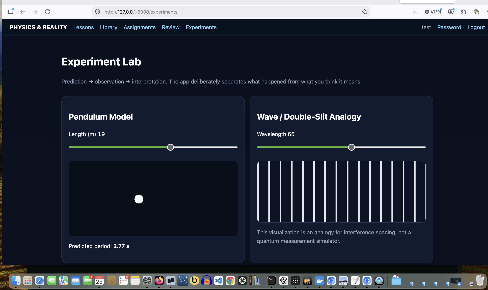

# Physics & Reality Tutor

[](https://github.com/iamrichmack111/physics-reality-tutor/actions/workflows/ci.yml)
[](https://github.com/iamrichmack111/physics-reality-tutor/actions/workflows/codeql.yml)
[](https://github.com/iamrichmack111/physics-reality-tutor/pkgs/container/physics-reality-tutor)
[](https://physics.richmackos.com)

A self-paced Physics, Philosophy, Logic & ELA learning system built around Aristotelian argument, primary sources, interactive experiments, adaptive mastery, and self-grading.

## Screenshot



## D2 diagrams

Architecture and learning-flow diagrams are maintained as D2 source in `docs/diagrams/` and validated/rendered by CI.

A local Flask/SQLite course for teaching physics, philosophy, Aristotelian argument, debate, and critical thinking.

## Included
- Student + admin authentication
- Initial admin login `admin` / `admin`
- Forced password change on first login
- Admin creates/disables accounts, resets passwords, resets progress
- Data-driven lessons with Question → Definitions → Proposition → 3 Proofs → simplified syllogisms → Counter-Proposition → Restatement
- Self-graded multiple-choice lesson checks and assignments
- 80% lesson mastery threshold
- Debate mode with definition agreement and side switching
- Public-domain primary-source reading library starter for Aristotle, Berkeley, and Hume
- Reading progress
- Manim scene source for definitions, syllogisms, limited rendering, information, mathematical universe, and simulation
- Student progress dashboard
- Docker support

## Run locally
```bash
cd physics_reality_tutor
./run.sh
```
Open `http://127.0.0.1:5088`.

## Docker
```bash
docker compose up --build
```

## First login
- Username: `admin`
- Password: `admin`

The app immediately requires a new password of at least 8 characters.

## Manim
Manim is intentionally optional because its system dependencies are larger than the web app. After installing Manim locally:
```bash
./render_animations.sh
```
The rendered MP4 files are copied into `static/animations/` and automatically appear in lessons.

## Public-domain texts
The starter database includes short teaching selections and prompts, not full books. For redistribution, import a verified public-domain edition/translation appropriate to your jurisdiction and retain source/edition metadata. Suggested core works:
- Aristotle, *The Categories*
- George Berkeley, *A Treatise Concerning the Principles of Human Knowledge*
- David Hume, *An Enquiry Concerning Human Understanding*

## Course growth
The starter includes six complete lessons. The architecture is intended for an approximately 80–120 hour course. Add units for light, motion, relativity, quantum measurement, double-slit experiments, entropy, black holes, Planck scale, determinism, free will, extraordinary claims, and scientific falsifiability.

## Full public-domain book reader

The Library includes a structured reader with previous/next navigation, bookmarks, font controls, reading progress, and self-graded reading checks. The initial database contains short tutor selections so the app works offline immediately.

To replace those starter selections with the complete public-domain Project Gutenberg texts while preserving users, lesson progress, and assignment results:

```bash
source .venv/bin/activate
python import_public_domain_books.py
```

The importer downloads Aristotle's *Categories*, Berkeley's *Principles of Human Knowledge*, and Hume's *Enquiry Concerning Human Understanding*, divides them into readable sections, and stores the full text in SQLite. Existing reading progress for the replaced starter excerpts is reset because the chapter structure changes.

## Mastery Engine Upgrade
This build adds adaptive skill scores, confidence calibration, spaced repetition review, a drag/drop argument builder, recorded debate side-switching, and an experiment journal. Existing databases migrate automatically; do not delete `data/physics_reality.db` when updating an existing installation.


## Self-Paced + ELA Upgrade
This build integrates Physics, Philosophy, Logic, and ELA. The dashboard recommends the next activity, giving spaced review priority over new material. The Experiment Lab now binds the pendulum animation speed to the physical period T = 2π√(L/g), includes variables/objectives and data graphing, and saves journals to a permanent Lab Notebook. The homepage includes `static/course_map.d2` plus a theme-matched SVG render. The ELA strand tracks reading comprehension, argument structure, source/evidence reasoning, debate, and writing practice.

## Auto-Grading & Adaptive Learning Upgrade

This build adds:

- Placement diagnostic for ELA, Logic, Physics, and Math
- Adaptive dashboard recommendations
- Spaced vocabulary review
- Evidence Locker with source-quality/completeness scoring
- Writing & Revision Lab with transparent structural rubric
- Cross-subject mastery points
- Automatic competency awards from lessons, reading checks, assignments, debates, argument building, and experiments

### What is fully self-graded

Multiple choice, reading checks, assignments, diagnostic questions, vocabulary matching, spaced review, and argument-structure matching are fully self-graded.

Writing and source work receive automatic rubric scores for measurable structure/completeness. The program deliberately does not claim that a philosophical conclusion is true merely because a response contains the required components.

### Upgrade an existing installation

Unzip over the current project folder. Keep `data/physics_reality.db`; new tables are created automatically on startup.