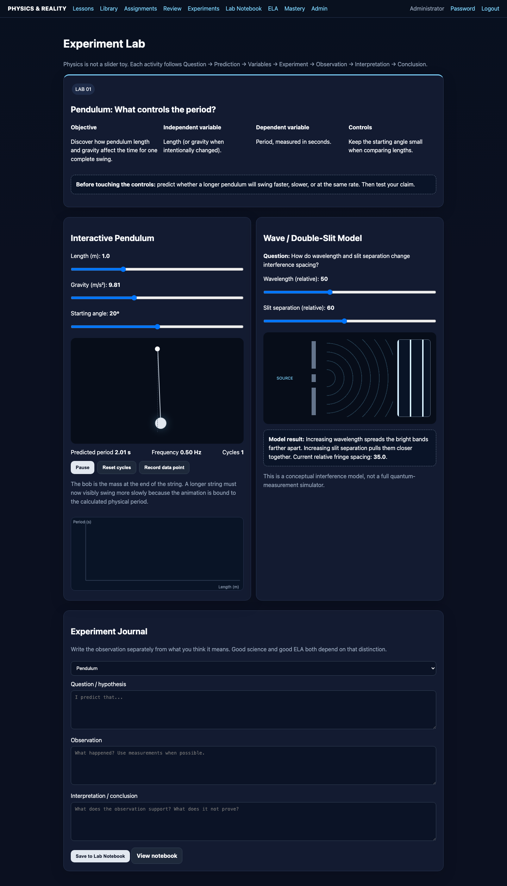

# Experiment Lab

Every experiment should be documented using the same scientific template.

## Experiment template

### Question
What are we trying to learn?

### Definitions
Which terms must be operationally clear?

### Hypothesis or proposition
What outcome is predicted?

### Independent variable
What does the learner deliberately change?

### Dependent variable
What measured behavior responds?

### Controlled variables
What should remain unchanged?

### Prediction
What should happen if the model is correct?

### Observation
What actually happened?

### Interpretation
What does the result support?

### Alternative explanation
What else could account for the observation?

### What this demonstrates
The narrow conclusion justified by the model.

### What this does not demonstrate
Claims that would exceed the evidence.

## The moving-ball simulation

A moving ball can demonstrate relationships among update rate, velocity, distance, time, sampling, or visual representation depending on the implemented controls.

A slider should never be pedagogically decorative. If it represents speed, changing it must alter the ball's displacement per unit time. If it represents observation rate or frame rate, the interface must explain why the apparent motion changes while the underlying modeled velocity may not.

Every interactive control should therefore display:

* variable name;
* current value;
* units where applicable;
* expected effect;
* explanatory text.

This turns an animation into an experiment.
