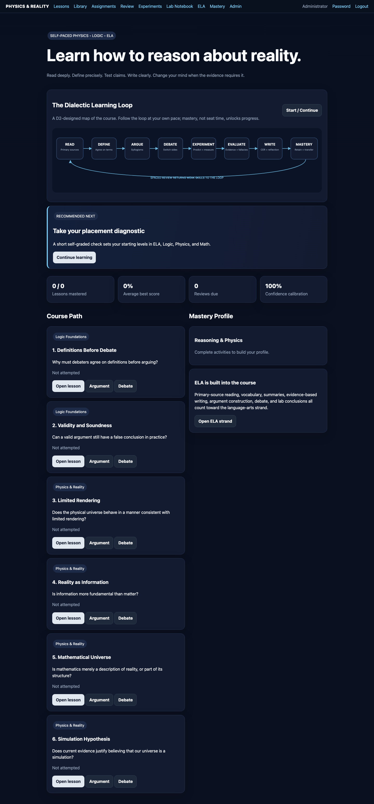
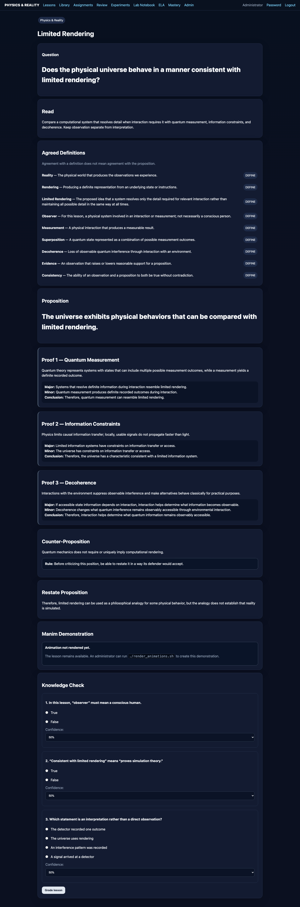
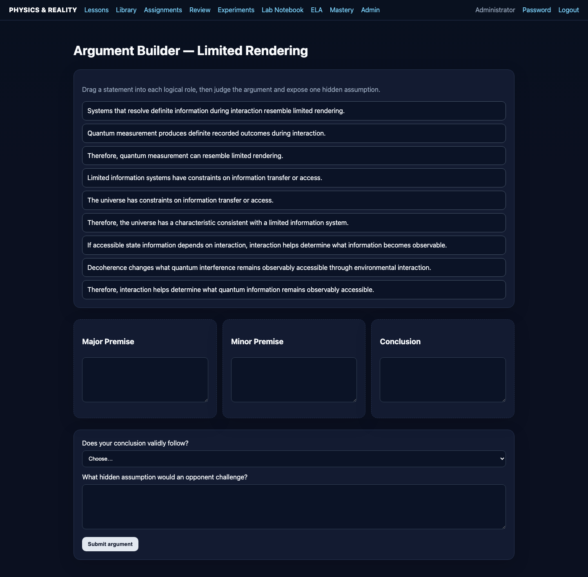
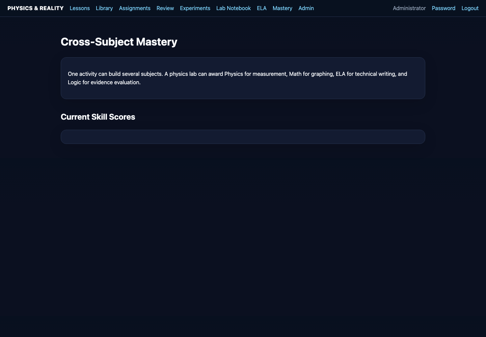

# Physics & Reality Tutor

Physics & Reality Tutor is a self-paced learning environment combining introductory physics, philosophy of reality, formal reasoning, debate, reading, writing, experiments, and mastery-based assessment.

The central instructional principle is that students should learn **how to reason about a proposition before being told what conclusion to hold**.

A lesson therefore does not begin with “believe this.” It begins with a question, agreed definitions, a proposition, evidence, simplified syllogisms, counterarguments, and a requirement that the learner accurately restate the competing position.

## Core learning cycle

1. Define the terms.
2. Ask a precise question.
3. State a proposition.
4. Present evidence.
5. Convert each proof into a simple syllogism.
6. Examine the counter-proposition.
7. Identify assumptions and fallacies.
8. Restate the strongest version of the proposition.
9. Test understanding.
10. Review weak competencies.
11. Apply the reasoning skill to a new problem.

## What the course integrates

The application combines four academic domains rather than treating them as unrelated subjects.

**Physics** supplies models, measurement, experiments, prediction, motion, observation, and questions about physical law.

**Philosophy** supplies questions about knowledge, reality, perception, causation, inference, and the limits of what observations establish.

**Logic and debate** supply definitions, propositions, premises, conclusions, syllogisms, counterarguments, steelmanning, burden of proof, and fallacy analysis.

**ELA** supplies primary-source reading, vocabulary, comprehension, summarization, explanatory writing, evidence citation, comparison, and argumentative composition.

## Student experience

The dashboard is the student's navigation and progress center.

Lessons explicitly separate the proposition from the evidence offered for it.

Interactive demonstrations provide models students can manipulate and discuss.

The reader makes public-domain primary sources part of the course rather than an optional external resource.

The Argument Builder turns reasoning into a repeatable structure.

Mastery tracking is intended to answer a more useful question than “Did the student finish the page?”: **Which competencies can the student demonstrate independently?**

## Important epistemic rule

A proposition being logically possible is not the same as it being scientifically established.

For example:

> A simulated universe could conserve computational resources by representing some information only when interaction requires it.

is a proposition about what a simulation *could* do.

It is not equivalent to:

> Physics has demonstrated that our universe uses limited rendering.

Throughout the course, students are expected to distinguish demonstration, analogy, consistency, plausibility, inference, evidence, and proof.

## Engineering overview

The application uses Flask/Jinja for the web application, SQLite for persistent course data, Manim for explanatory animations, D2 for architecture-as-code, Playwright for browser validation and screenshots, GitHub Actions for CI, CodeQL and dependency/security checks, Docker Buildx for packaging, and GHCR for multi-architecture distribution.

Continue with [[Course-Philosophy]] or [[Student-Guide]].
