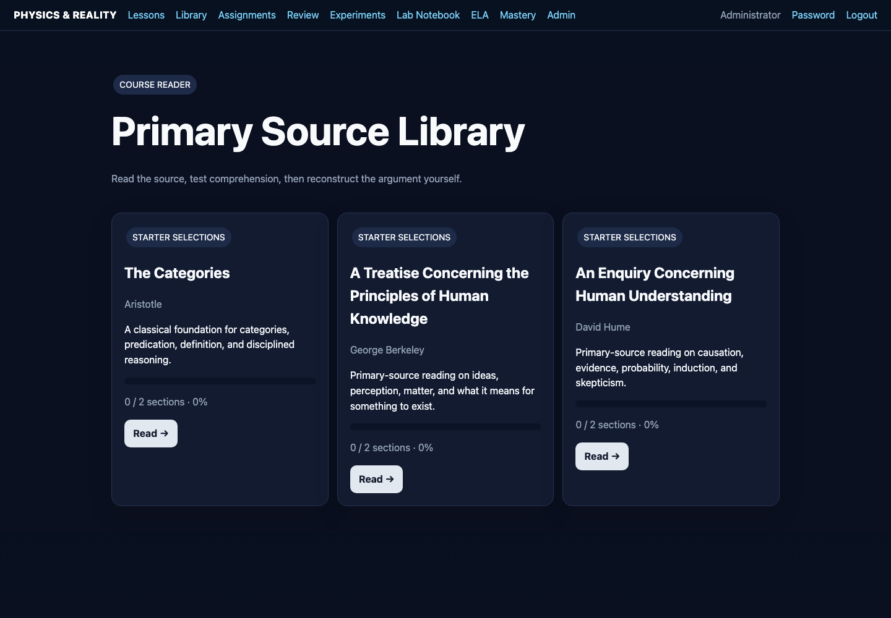
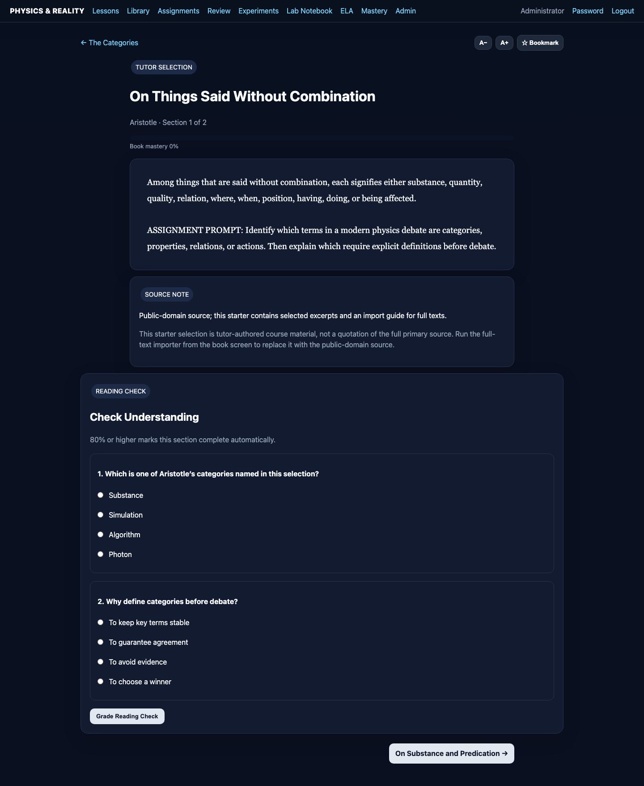

# Primary-Source Library

The integrated reader makes source reading part of the instructional loop.

Current imported public-domain material includes Aristotle's *Categories*, George Berkeley's *A Treatise Concerning the Principles of Human Knowledge*, and David Hume's *An Enquiry Concerning Human Understanding*.

## Why primary sources

Primary sources teach students to distinguish an author's actual argument from a later summary of that argument.

## Reading workflow

1. Preview vocabulary.
2. Read a manageable section.
3. Identify the author's question.
4. Identify important definitions.
5. State the author's proposition.
6. Locate supporting reasoning.
7. Summarize the passage without adding an opinion.
8. Critique only after accurate summary.
9. Complete the associated assignment.

## Reader design

Long books are divided into reader sections so the student can progress incrementally. Reading completion and assignments can be tied to mastery records.
